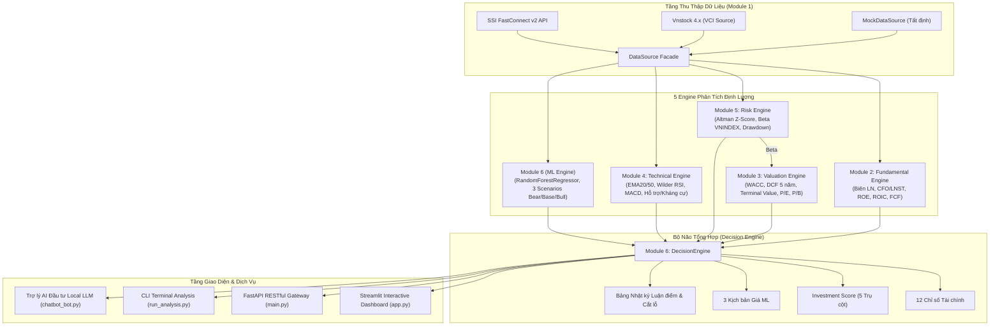

# 🚀 AI Financial & Investment Intelligence Platform

<div align="center">

[](https://www.python.org/)
[](https://fastapi.tiangolo.com/)
[](https://streamlit.io/)
[](https://scikit-learn.org/)
[](https://vnstocks.com)
[](https://www.ssi.com.vn/)
[](https://github.com/microsoft/pyright)
[](test_system.py)
[](LICENSE)

**Nền tảng phân tích tài chính và hỗ trợ quyết định đầu tư định lượng chuyên sâu cho thị trường chứng khoán Việt Nam.**

*Nhập 1 mã cổ phiếu bất kỳ → Hệ thống tự động thu thập dữ liệu thô, chạy mô hình định giá & học máy, rồi xuất ra 12 chỉ số tài chính, Investment Score phân rã 5 trụ cột, 3 kịch bản giá và bảng nhật ký luận điểm đầu tư.*

</div>

---

## 📸 Giao diện Nền tảng (Show, Don't Tell)


---

## 🌟 4 Trụ Cột Đầu Ra Cốt Lõi (Core Deliverables)

| Trụ cột | Mô tả chi tiết | Ý nghĩa thực chiến |
|:---|:---|:---|
| **1. Lưới 12 Chỉ số Định lượng** | Chuẩn hóa 12 chỉ số then chốt từ BCTC, định giá, động lượng và rủi ro (Biên gộp, Biên EBIT, CFO/LNST, FCF TTM, ROE, ROIC, Nợ vay/VCSH, Current Ratio, P/E, P/B, RSI-14, Altman Z). | Bóc tách toàn diện sức khỏe doanh nghiệp, phát hiện rủi ro tiềm ẩn và bẫy giá trị. |
| **2. Investment Score (0 - 100)** | Điểm số tổng hợp được phân rã minh bạch trên 5 trụ cột: Sức khỏe cơ bản (30%), Định giá DCF (25%), Động lượng kỹ thuật (20%), Quản trị rủi ro (15%) và Dự báo ML (10%). | Ra quyết định khách quan, triệt tiêu cảm xúc và thiên kiến tâm lý cá nhân. |
| **3. 3 Kịch bản Giá (ML Forecasting)** | Mô hình `RandomForestRegressor` kết hợp phân phối độ bất định mô hình và độ lệch chuẩn biến động lịch sử để dự phóng 3 kịch bản giá sau 10 phiên: **Bear Case** (rủi ro), **Base Case** (cơ sở) và **Bull Case** (bứt phá). | Cung cấp khoảng tin cậy đối xứng 95% để thiết lập tỷ lệ Risk/Reward chính xác. |
| **4. Bảng Nhật ký Đầu tư (Thesis Journal)** | Tự động sinh luận điểm mua/bán, catalysts, rủi ro bear case, giá mua đề xuất, giá mục tiêu chốt lời, ngưỡng cắt lỗ kỷ luật (-10%) và tỷ trọng phân bổ vốn tối đa $\le 15\%$ NAV. | Chuẩn hóa kỷ luật quản trị danh mục và ghi chép nhật ký giao dịch chuyên nghiệp. |

---

## 🏗️ Sơ đồ Kiến trúc Hệ thống (System Architecture)




---

## 📊 Bảng Chi Tiết 12 Chỉ Số Định Lượng

| Nhóm | Chỉ số | Công thức / Đo lường | Ngưỡng đánh giá chuẩn |
|:---|:---|:---|:---|
| **Cơ bản** | **Biên Lợi Nhuận Gộp** | $\frac{\text{Lợi nhuận gộp}}{\text{Doanh thu thuần}}$ | $\ge 25\%$ (Lợi thế cạnh tranh con hào kinh tế) |
| **Cơ bản** | **Biên EBIT** | $\frac{\text{EBIT}}{\text{Doanh thu thuần}}$ | $\ge 15\%$ (Hiệu quả hoạt động cốt lõi) |
| **Cơ bản** | **Chất Lượng Dòng Tiền** | $\frac{\text{CFO}}{\text{LNST}}$ | $\ge 1.0$ (Lợi nhuận được bảo chứng bằng tiền mặt thật) |
| **Cơ bản** | **Dòng Tiền Tự Do (FCF)** | $\text{CFO} - \text{CAPEX}$ | Dương và tăng trưởng bền vững |
| **Cơ bản** | **ROE** | $\frac{\text{LNST}}{\text{Vốn chủ sở hữu bình quân}}$ | $\ge 15\%$ (Sinh lời vốn cổ đông xuất sắc) |
| **Cơ bản** | **ROIC** | $\frac{\text{NOPAT}}{\text{Vốn đầu tư}}$ | $\ge \text{WACC} + 3\%$ (Tạo lập giá trị kinh tế gia tăng) |
| **Cơ bản** | **Đòn Bẩy Nợ Vay (D/E)** | $\frac{\text{Tổng nợ vay có lãi}}{\text{Vốn chủ sở hữu}}$ | $\le 1.0$ (Cấu trúc vốn an toàn) |
| **Cơ bản** | **Hệ Số Thanh Toán Hiện Hành** | $\frac{\text{Tài sản ngắn hạn}}{\text{Nợ ngắn hạn}}$ | $\ge 1.5$ (Thanh khoản lành mạnh) |
| **Định giá** | **P/E (TTM)** | $\frac{\text{Thị giá}}{\text{EPS TTM}}$ | So sánh với P/E lịch sử và P/E trung vị ngành |
| **Định giá** | **P/B** | $\frac{\text{Thị giá}}{\text{Giá trị sổ sách/CP}}$ | So sánh với ROE tương ứng |
| **Kỹ thuật** | **RSI (14) Wilder** | Công thức làm mượt cổ điển Wilder | $30 - 70$ (Tránh mua khi quá mua $>70$) |
| **Rủi ro** | **Altman Z-Score** | $1.2X_1 + 1.4X_2 + 3.3X_3 + 0.6X_4 + 0.999X_5$ | $> 2.9$ (Vùng an toàn - Safe Zone) |

---

## 💎 Tính Năng Định Lượng Cao Cấp (Institutional Quant Upgrade)

### 1. 📋 Piotroski F-Score (0 - 9 Điểm)
Đo lường sức khỏe tài chính toàn diện qua 9 bài test kế toán khắt khe thuộc 3 nhóm: **Sinh lời** (ROA > 0, CFO > 0, $\Delta$ROA > 0, CFO > LNST), **Đòn bẩy & Thanh khoản** ($\Delta$Nợ dài hạn $\le 0$, $\Delta$Current Ratio $\ge 0$, Không pha loãng CP), và **Hiệu quả hoạt động** ($\Delta$Biên gộp $\ge 0$, $\Delta$Vòng quay TS $\ge 0$).

### 2. 🛡️ Beneish M-Score (Cảnh Báo Thao Túng BCTC)
Mô hình toán học 8 biến số của GS. Messod Beneish giúp phát hiện các hành vi "xào nấu" số liệu kế toán:
$$M = -4.84 + 0.920\text{DSRI} + 0.528\text{GMI} + 0.404\text{AQI} + 0.892\text{SGI} + 0.115\text{DEPI} - 0.172\text{SGAI} + 4.037\text{TATA} + 0.0327\text{LVGI}$$
- $M > -1.78$: Tín hiệu cảnh báo nguy cơ cao doanh nghiệp đang thao túng lợi nhuận.
- $M \le -1.78$: Xác suất thao túng số liệu ở mức thấp (an toàn).

### 3. 🌡️ Ma Trận Phân Tích Độ Nhạy DCF 2 Chiều (Valuation Heatmap)
Khảo sát độ bền vững của định giá nội tại khi **Chi phí vốn (WACC)** từ $8\%$ đến $14\%$ và **Tăng trưởng vĩnh viễn ($g$)** từ $1.5\%$ đến $4.0\%$ biến động theo chu kỳ vĩ mô. Trực quan hóa bằng biểu đồ Heatmap tương tác trên Streamlit.

### 4. 🔍 Bộ Lọc Cổ Phiếu Đa Mã (Stock Screener & Radar Comparison)
Quét và so sánh đồng thời nhiều cổ phiếu (nhóm VN30 hoặc mã tùy biến). Tự động xếp hạng theo **Investment Score**, **P/E**, **ROE**, **Biên EBIT**, **Piotroski F-Score** và vẽ biểu đồ **Radar 5 Trụ Cột** so sánh đa lớp.

### 5. 💼 Tối Ưu Hóa Danh Mục Markowitz (Efficient Frontier)
Mô phỏng Monte Carlo 1,000 danh mục trên chuỗi dữ liệu thực tế để tìm ra:
- **Max Sharpe Portfolio**: Tối đa hóa tỷ suất sinh lời trên mỗi đơn vị rủi ro.
- **Min Volatility Portfolio**: Rủi ro biến động thấp nhất (bảo toàn vốn).
- Xuất bảng phân bổ vốn đề xuất (tỷ trọng % NAV và số tiền VNĐ cụ thể).

---

## ⚡ Hướng Dẫn Cài Đặt & Khởi Chạy Nhanh

### 1. Khởi tạo môi trường ảo

Yêu cầu **Python 3.10 trở lên** (khuyến nghị Python 3.12 hoặc 3.13):

```bash
# Clone dự án
git clone https://github.com/ducnguyen20806-rgb/AI-FINANCIAL-INVESTMENT-INTELLIGENCE.git
cd AI-FINANCIAL-INVESTMENT-INTELLIGENCE

# Tạo môi trường ảo
python -m venv .venv

# Kích hoạt trên Windows (PowerShell):
.\.venv\Scripts\Activate.ps1
# Hoặc trên macOS/Linux:
source .venv/bin/activate

# Cài đặt toàn bộ thư viện cần thiết
pip install -r requirements.txt
```

### 2. Cấu hình biến môi trường (`.env`)

Hệ thống sử dụng một file `.env` duy nhất tại thư mục gốc. Khi chạy lần đầu, bạn có thể tạo `.env` với nội dung:

```env
# --- Kết nối SSI FastConnect v2 (Tùy chọn) ---
SSI_CONSUMER_ID=your_consumer_id_here
SSI_CONSUMER_SECRET=your_consumer_secret_here
SSI_BASE_URL=https://fc-data.ssi.com.vn/api/v2
SSI_FINANCIAL_ENDPOINT=/Market/CompanyFinancialRatio

# --- Chế độ dữ liệu ---
USE_MOCK=false
FALLBACK_TO_MOCK=true

# --- Tham số mô hình định lượng ---
RISK_FREE_RATE=0.030
EQUITY_RISK_PREMIUM=0.080
CORPORATE_TAX_RATE=0.20
TERMINAL_GROWTH=0.030
MARKET_INDEX=VNINDEX
```

> **Ghi chú:** Khi chưa có tài khoản SSI FastConnect, hệ thống sẽ tự động sử dụng **Vnstock 4.x** để lấy giá thật từ sàn và kích hoạt **MockDataSource tất định** cho các trường hợp thiếu BCTC, đảm bảo 100% chức năng phân tích vẫn chạy trơn tru mà không bị gián đoạn.

---

### 3. Vận Hành Nền Tảng — Khởi Động Toàn Bộ Dự Án Trong 1 Lệnh Duy Nhất 🚀

Toàn bộ hệ thống (Web Platform, Môi trường ảo, Cổng xác thực, và Trình duyệt) được đóng gói khởi chạy chỉ với **1 lệnh duy nhất**:

```bash
python run.py
```
> **Dành cho Windows:** Bạn cũng có thể nhấp đúp file `run.bat` hoặc chạy `.\run.ps1` trong PowerShell!

Trình khởi chạy sẽ tự động:
1. Nhận diện và nạp môi trường ảo `.venv`.
2. Khởi động Web Platform bảo mật với **Cổng Đăng Nhập Hoạt Hình Kéo Dây Đèn (Lamp Login)**.
3. Tự động bật trình duyệt web tới địa chỉ `http://localhost:8501`.

#### Các tùy chọn nâng cao với 1 lệnh:
```bash
python run.py               # Chạy Web Platform (Streamlit + Lamp Login)
python run.py --with-api    # Chạy đồng thời cả FastAPI Gateway (port 8000) & Web App (port 8501)
python run.py --desktop     # Chạy ứng dụng Desktop Tkinter độc lập (login_lamp.py)
python run.py --api-only    # Chỉ khởi chạy RESTful FastAPI Gateway
python run.py --test        # Chạy tự động toàn bộ 66 ca kiểm thử chất lượng
```

---

### 💡 Cổng Đăng Nhập Hoạt Hình Kéo Dây Đèn (Lamp Login Animation)

Hệ thống được bảo vệ bởi cổng đăng nhập phong cách thẩm mỹ tối giản sang trọng:
- **Tương tác kéo dây vật lý**: Nhấp và kéo dây đèn bằng chuột, vuốt chạm cảm ứng hoặc phím Cách (Space) với hiệu ứng nảy lò xo (spring overshoot bounce).
- **Chuyển màu mượt mà**: Phòng chuyển từ trạng thái tối (`#121417`) sang ánh sáng ấm (`#1c1f24`), chùm sáng rọi xuống bàn làm việc và thẻ đăng nhập viền vàng kim (`#d8b45f`) bừng sáng.
- **Đăng nhập tiện lợi**: Hỗ trợ tài khoản mẫu (`admin` / `admin`) hoặc nút **"⚡ Đăng nhập nhanh (Khách / Demo)"** chỉ với 1 cú nhấp chuột.
- **Bản Desktop đi kèm**: File độc lập `login_lamp.py` viết bằng Python Tkinter thuần, không cần cài đặt thêm bất kỳ thư viện nào (`python login_lamp.py`).

---

#### Khởi chạy thủ công từng dịch vụ riêng lẻ:

##### A. Giao diện Web Streamlit
```bash
streamlit run app.py
```
👉 Mở trình duyệt tại: `http://localhost:8501`

##### B. RESTful API Gateway (FastAPI)
```bash
uvicorn main:app --reload --port 8000
```
👉 Truy cập Swagger UI: `http://localhost:8000/docs` hoặc trang Lamp Login Web tại `http://localhost:8000/login`

##### C. Chạy Phân tích Nhanh từ Dòng lệnh (CLI)
```bash
# In báo cáo phân tích tổng quan
python run_analysis.py FPT

# Xuất kết quả phân tích chuẩn JSON
python run_analysis.py FPT --json
```

##### D. Chạy Toàn Bộ 66 Ca Kiểm Thử Hệ Thống
```bash
python test_system.py
```

---

## 💬 Trợ Lý AI Đầu Tư Tích Hợp (Ollama Local LLM)

Tab 9 của ứng dụng tích hợp sẵn Trợ lý AI phân tích đầu tư hoạt động cục bộ thông qua mô hình ngôn ngữ lớn (LLM):
1. Cài đặt [Ollama](https://ollama.com/) trên máy tính.
2. Tải và chạy mô hình:
   ```bash
   ollama run qwen2.5
   ```
3. Cài đặt thư viện Python:
   ```bash
   pip install ollama
   ```
Trợ lý AI sẽ tự động đọc ngữ cảnh điểm số, 12 chỉ số tài chính, kịch bản giá ML và luận điểm đầu tư của cổ phiếu đang xem để đàm thoại và giải đáp chi tiết cho nhà đầu tư.

---

## 🧪 Đảm Bảo Chất Lượng & Tính Toàn Vẹn (Quality Assurance)

Codebase được kiểm soát nghiêm ngặt với:
- **Pyright Static Type Checker**: `0 errors, 0 warnings` (Chế độ `basic` type checking).
- **Bộ 55 Unit & Robustness Tests**: Kiểm thử toàn diện từ tính toán WACC, DCF, EMA, RSI Wilder, Altman Z, đến khả năng xử lý an toàn dữ liệu khuyết thiếu và nến rỗng.

---

## 📜 Giấy phép

Dự án được phân phối dưới giấy phép **MIT License**. Mọi đóng góp (Pull Request, Issue) đều được hoan nghênh!

